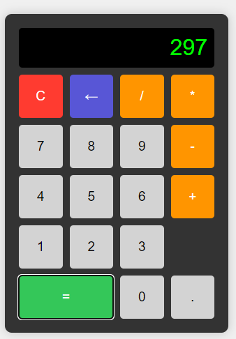

# calculadora
uma calculadora simples com HTML, CSS e JS

## Como usar
Você usa como uma calculadora normal do Windows, clicando nos números, nas operações e vendo o que foi selecionado aparecer no visor.  

